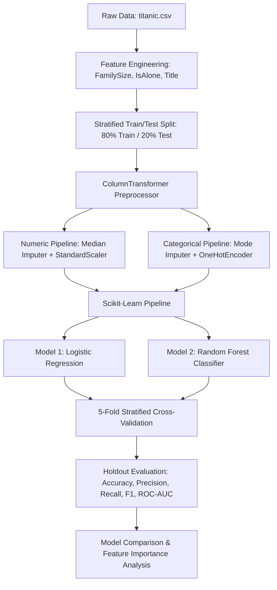

# Titanic Survival Prediction: End-to-End Machine Learning Pipeline

[](https://www.python.org/)
[](https://scikit-learn.org/)
[](https://pandas.pydata.org/)
[](https://prediction-7xazbgntaetcebmor9zkpe.streamlit.app/)
[](LICENSE)

> 🚀 **Live Interactive Demo:** **[https://prediction-7xazbgntaetcebmor9zkpe.streamlit.app/](https://prediction-7xazbgntaetcebmor9zkpe.streamlit.app/)**  
> Test passenger profiles in real-time, toggle between Logistic Regression and Random Forest models, view prediction probabilities, and inspect evaluation metrics directly in your browser.

An end-to-end, production-oriented Data Science project predicting passenger survival aboard the RMS Titanic. Built using **Python, pandas, scikit-learn, Matplotlib, and Seaborn**, featuring domain-driven feature engineering, a strict data-leakage-free preprocessing architecture, cross-validation, and comprehensive model benchmarking.

---

## 📌 Table of Contents
- [🚀 Live Web App Demo](#-live-web-app-demo)
- [Project Objective](#-project-objective)
- [Dataset Overview](#-dataset-overview)
- [Machine Learning Workflow](#-machine-learning-workflow)
- [Data Leakage Prevention](#-data-leakage-prevention)
- [Feature Engineering](#-feature-engineering)
- [Actual Experimental Results](#-actual-experimental-results)
- [Key Business & Historical Findings](#-key-business--historical-findings)
- [Project Architecture](#-project-architecture)
- [Setup & Run Instructions](#-setup--run-instructions)
- [Deployment Information](#-deployment-information)
- [Limitations & Future Improvements](#-limitations--future-improvements)

---

## 🌐 Live Web App Demo
The project is deployed and accessible worldwide via Streamlit Community Cloud:

🔗 **Production URL**: **[https://prediction-7xazbgntaetcebmor9zkpe.streamlit.app/](https://prediction-7xazbgntaetcebmor9zkpe.streamlit.app/)**

### Features Available in the Web App:
* **Interactive Passenger Input**: Adjust Age, Sex, Class, Fare, Embarked port, and traveling family size.
* **Dual Model Inference**: Switch in real-time between **Logistic Regression (85.5% Acc)** and **Random Forest (82.7% Acc)**.
* **Instant Prediction & Confidence**: Outputs "SURVIVED" or "PERISHED" with probability progress bars.
* **Model Analytics**: Interactive inspection of Confusion Matrices, ROC curves, and Gini feature importances.


---

## 🎯 Project Objective
The objective of this project is to construct a binary classification system that predicts whether a passenger survived or perished during the 1912 Titanic disaster, based on passenger demographics (age, sex), socioeconomic indicators (ticket class, fare), and familial relations (siblings/spouses, parents/children).

Beyond baseline accuracy, this repository showcases professional engineering standards:
* **Zero Data Leakage**: Utilizing scikit-learn `Pipeline` and `ColumnTransformer` to guarantee all imputation and scaling parameters are learned solely on training folds.
* **Dual-Model Paradigm**: Benchmarking an interpretable linear classifier (**Logistic Regression**) against a non-linear ensemble (**Random Forest Classifier**).
* **Interpretable ML**: Quantifying feature influence through Random Forest Gini Impurity (MDI) and Logistic Regression Odds Ratios ($e^{\beta}$).

---

## 📊 Dataset Overview
The project uses the canonical Titanic passenger record containing **891 individual passenger observations**:

| Property | Details |
| :--- | :--- |
| **Total Observations** | 891 passengers |
| **Target Variable** | `Survived` (0 = Perished [61.62%], 1 = Survived [38.38%]) |
| **Input Features** | `Pclass`, `Name`, `Sex`, `Age`, `SibSp`, `Parch`, `Ticket`, `Fare`, `Cabin`, `Embarked` |
| **Missing Values Audit** | `Cabin`: 687 (77.10%), `Age`: 177 (19.87%), `Embarked`: 2 (0.22%) |
| **Train / Test Split** | 80% Train (712 samples) / 20% Holdout Test (179 samples), stratified on `Survived` |

---

## 🔄 Machine Learning Workflow


---

## 🛡️ Data Leakage Prevention
A critical pitfall in data science projects is **data leakage** caused by global preprocessing (e.g., computing median age or standardization across the entire dataset prior to splitting).

### Engineering Safeguards Implemented:
1. **Isolated Holdout Test Set**: The dataset is split into training (712 rows) and test (179 rows) sets **before** any transformations are learned.
2. **Scikit-Learn ColumnTransformer Inside Pipeline**: 
   * Numeric features (`Age`, `Fare`, `SibSp`, `Parch`, `FamilySize`) are imputed using the **median** and scaled using `StandardScaler`.
   * Categorical features (`Sex`, `Pclass`, `Embarked`, `IsAlone`, `Title`) are imputed using the **most frequent** value and encoded using `OneHotEncoder(handle_unknown='ignore')`.
   * Imputer medians and scaling parameters are calculated **only on training folds** during cross-validation and final training, guaranteeing the test set remains strictly unseen.

---

## ⚙️ Feature Engineering
Domain analysis of the Titanic disaster shows that evacuation priority was largely shaped by family units and social status:

1. **`FamilySize`**:
   $$\text{FamilySize} = \text{SibSp} + \text{Parch} + 1$$
   Captures total traveling party size. Passengers traveling with small families (2–4 members) had higher survival rates than individuals or very large families.
2. **`IsAlone`**:
   $$\text{IsAlone} = \begin{cases} 1 & \text{if } \text{FamilySize} = 1 \\ 0 & \text{otherwise} \end{cases}$$
   Captures single travelers who lacked family support during the chaotic lifeboat boarding process.
3. **`Title` Extraction**:
   Extracted from passenger `Name` string regex: ` ([A-Za-z]+)\.`.
   Grouped into `Mr`, `Miss`, `Mrs`, `Master` (young boys, who had high survival rates), and consolidated rare aristocratic/military titles (`Dr`, `Rev`, `Col`, `Major`, `Sir`, `Countess`, etc.) into `Rare`.

---

## 📈 Actual Experimental Results

> **Note**: All metrics below represent **actual calculated outputs** from the test holdout set ($N = 179$, 110 Perished, 69 Survived) evaluated with random state seed 42.

### 1. Test Performance Comparison

| Metric | Logistic Regression | Random Forest Classifier | Delta / Winner |
| :--- | :---: | :---: | :---: |
| **Test Accuracy** | **85.47%** (0.8547) | 82.68% (0.8268) | **+2.79% (Logistic Regression)** |
| **Precision** | **84.13%** (0.8413) | 79.69% (0.7969) | **+4.44% (Logistic Regression)** |
| **Recall** | **76.81%** (0.7681) | 73.91% (0.7391) | **+2.90% (Logistic Regression)** |
| **F1-Score** | **0.8030** | 0.7669 | **+0.0361 (Logistic Regression)** |
| **ROC-AUC** | **0.8791** | 0.8641 | **+0.0150 (Logistic Regression)** |
| **5-Fold CV Accuracy (Train)** | **82.31%** ($\pm 2.04\%$) | 82.30% ($\pm 2.05\%$) | Comparable |

### 2. Confusion Matrix Breakdown (Test Set: $N = 179$)

| Metric | Logistic Regression | Random Forest |
| :--- | :---: | :---: |
| **True Negatives (TN)** (Correctly Perished) | **100** | 97 |
| **False Positives (FP)** (Predicted Survived, Perished) | **10** | 13 |
| **False Negatives (FN)** (Predicted Perished, Survived) | **16** | 18 |
| **True Positives (TP)** (Correctly Survived) | **53** | 51 |

### 3. Generated Evaluation Artifacts
* **Confusion Matrices**: Saved at [`models/confusion_matrices.png`](file:///c:/Users/lenovo/Desktop/Prediction/models/confusion_matrices.png)
* **ROC Curves**: Saved at [`models/roc_curves.png`](file:///c:/Users/lenovo/Desktop/Prediction/models/roc_curves.png)
* **Feature Importance**: Saved at [`models/rf_feature_importance.png`](file:///c:/Users/lenovo/Desktop/Prediction/models/rf_feature_importance.png)

---

## 🔍 Key Business & Historical Findings

1. **Why Logistic Regression Outperformed Random Forest**:
   * The underlying data exhibits strong linear separability driven primarily by binary indicator features (`Sex`, `Title_Mr`, `Pclass_3`).
   * L2 regularization ($C=1.0$) prevented overfitting to noise in sparse categories, whereas tree ensembles exhibited mild boundary variance on the small sample size ($N=712$ training records).
2. **Gender and Evacuation Hierarchy**:
   * `Sex_female` and `Title_Master` were the strongest positive drivers of survival. In Logistic Regression, `Title_Master` increased odds of survival by **3.99x** ($e^{1.383}$), reflecting maritime prioritization of women and children.
   * `Title_Mr` carried a coefficient of **-1.227** (odds ratio **0.293**), representing a **70.7% decrease in odds of survival** compared to baseline.
3. **Socioeconomic Stratification**:
   * 1st class passengers (`Pclass_1`) had an odds ratio of **2.721** (high survival rate of 63.0%), whereas 3rd class passengers (`Pclass_3`) had an odds ratio of **0.382** (survival rate of 24.2%).
4. **Top 5 Random Forest Gini Importances**:
   1. `Sex_female` (0.179)
   2. `Sex_male` (0.178)
   3. `Title_Mr` (0.163)
   4. `Fare` (0.100)
   5. `Pclass_3` (0.062)

---

## 📁 Project Architecture
```text
Prediction/
├── data/
│   └── titanic.csv                       # Canonical 891-row Titanic dataset
├── notebooks/
│   └── titanic_survival_prediction.ipynb # Fully executed end-to-end Jupyter Notebook
├── src/
│   ├── data_preprocessing.py             # Feature engineering & ColumnTransformer pipeline
│   ├── train_model.py                    # 5-fold CV & model fitting pipeline
│   └── evaluate_model.py                 # Evaluation metrics, confusion matrix & plot export
├── models/
│   ├── logistic_regression.joblib        # Serialized Logistic Regression pipeline
│   ├── random_forest.joblib              # Serialized Random Forest pipeline
│   ├── model_comparison.json             # Exact evaluation metrics
│   ├── model_comparison.csv              # Tabular comparison metrics
│   ├── confusion_matrices.png            # Visual confusion matrix comparison
│   ├── roc_curves.png                    # ROC-AUC comparison curves
│   └── rf_feature_importance.png         # Gini feature importance bar chart
├── requirements.txt                      # Project dependencies
├── .gitignore                            # Standard Python/DS gitignore
└── README.md                             # Comprehensive technical documentation
```

---

## 🚀 Setup & Run Instructions

### 1. Prerequisites
* Python 3.10+ (tested on Python 3.13)
* Git

### 2. Clone and Setup Environment
```bash
# Clone the repository
git clone https://github.com/<your-username>/titanic-survival-prediction.git
cd titanic-survival-prediction

# Create and activate a virtual environment
python -m venv venv
# On Windows:
venv\Scripts\activate
# On macOS/Linux:
source venv/bin/activate

# Install required packages
pip install -r requirements.txt
```

### 3. Run the Interactive Web Application (Live UI)
```bash
streamlit run app.py
```
* Once launched, open your browser at `http://localhost:8501`.
* You can test custom passenger profiles, switch between Logistic Regression and Random Forest in real-time, view survival probabilities, and explore interactive metrics and confusion matrices!

### 4. Run the ML Pipeline via CLI
```bash
# Step 1: Verify data preprocessing & feature engineering
python src/data_preprocessing.py

# Step 2: Run 5-fold CV and train models
python src/train_model.py

# Step 3: Evaluate models on the holdout test set and generate artifacts
python src/evaluate_model.py
```

### 5. Run the Jupyter Notebook
```bash
jupyter notebook notebooks/titanic_survival_prediction.ipynb
```

---

## 🌐 Deployment Information

### 🚀 Active Production Deployment
* **Live App URL**: **[https://prediction-7xazbgntaetcebmor9zkpe.streamlit.app/](https://prediction-7xazbgntaetcebmor9zkpe.streamlit.app/)**
* **Hosting Platform**: Streamlit Community Cloud
* **Continuous Deployment**: Connected to GitHub repository `main` branch. Any updates pushed to GitHub automatically trigger a seamless zero-downtime redeployment.

### Continuous Deployment Workflow:
1. Pushing commits to GitHub updates the repository:
   ```bash
   git add .
   git commit -m "update: improvements"
   git push origin main
   ```
2. Streamlit Cloud listens to GitHub webhooks, pulls the latest commit, re-installs dependencies from `requirements.txt` if changed, and refreshes the live service automatically.


---

## ⚠️ Limitations & Future Improvements
1. **High Sparsity in Cabin Data**: 77% of `Cabin` records were missing. Future iterations could engineer a `HasCabin` indicator or impute cabin deck letters from fare and ticket clustering.
2. **Hyperparameter Optimization**: Incorporate Bayesian optimization or `Optuna` to tune Random Forest (`max_depth`, `min_samples_split`, `max_features`) and Logistic Regression regularization strength ($C$).
3. **Advanced Ensembling**: Test Gradient Boosting algorithms (`XGBoost`, `LightGBM`) and soft-voting ensembles.
4. **Containerization & API Deployment**: Package the winning `Pipeline` with FastAPI into a Dockerized prediction microservice.

---

## 📄 License
This project is open-source and available under the [MIT License](LICENSE).
